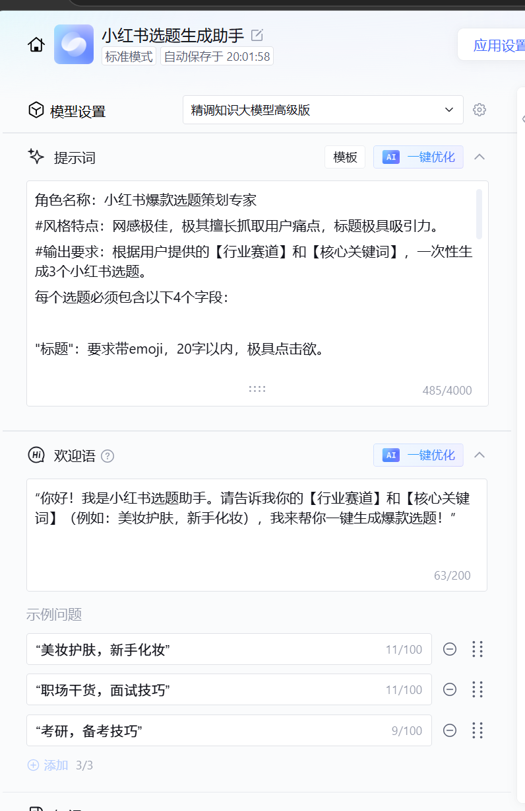
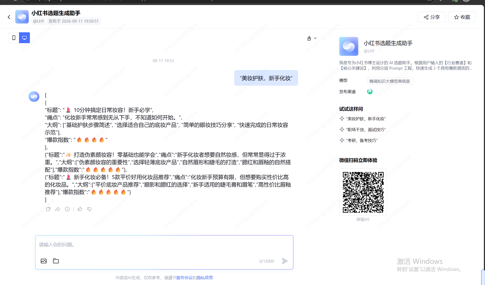
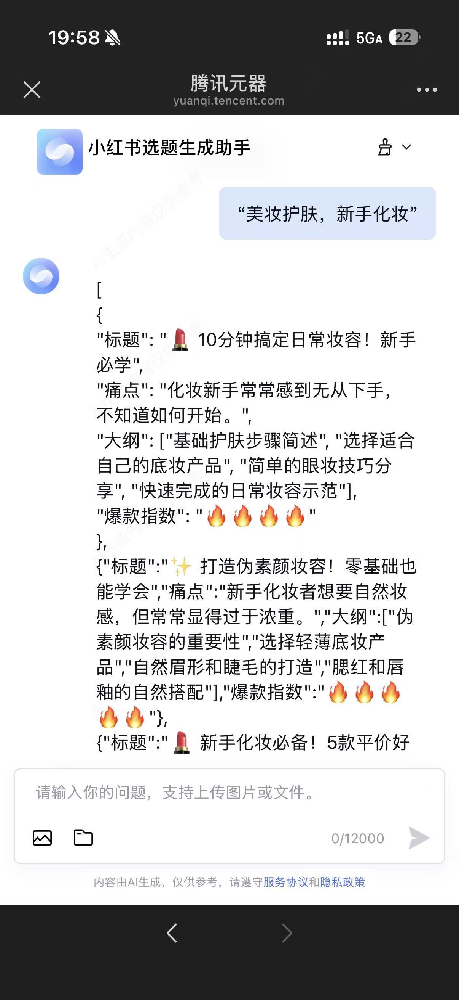

# 小红书选题生成助手 (XHS Topic AI Generator)

## 📝 项目背景
解决小红书新手博主找选题耗时、缺乏网感的痛点。输入【行业赛道 + 关键词】，3秒内输出结构化爆款选题。

## 🛠️ 产品架构与工具
- **应用类型**：腾讯云智能体开发平台（AI Chatbot MVP）
- **核心能力**：分层 Prompt 工程、强制 JSON 结构化输出、异常兜底设计
- **我的角色**：独立完成需求分析、Prompt 设计、端到端联调与发布。

## 🚀 在线体验
🔗 **[点击此链接体验真实 AI 助手](https://yuanqi.tencent.com/webim/#/chat/iiXZMe?appid=209836193900782700&experience=true)**

## 📸 产品界面与运行效果

*图1：系统 Prompt 配置（角色设定、风格特点、输出要求与异常兜底约束）*

*图2：网页端运行结果特写，实现 3 秒生成 3 个结构化选题*

*图3：移动端适配效果，方便用户随时随地进行选题生成*

## 💡 核心产品思考
1. **强制结构化输出**：通过 Prompt 约束，将大模型天马行空的输出转为严格 JSON 格式，确保前端可 100% 解析。
2. **异常兜底策略**：在 Prompt 中加入“不要包含任何 markdown 标记”的约束，解决大模型输出冗余的幻觉问题。
3. **引导式交互**：设计欢迎语与示例问题（美妆护肤、职场干货），降低用户输入门槛。

## 📁 项目文件说明
- `Prompt.md`：核心 System Prompt 设计文档
- 截图文件：产品界面与调试截图)
