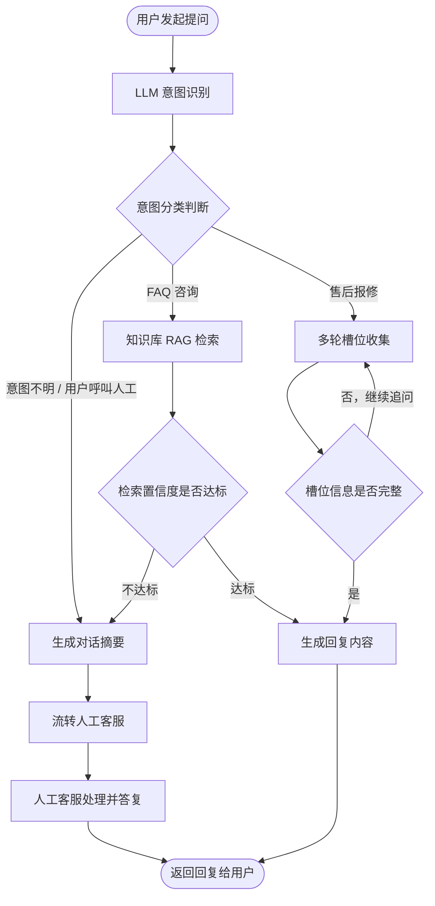

# AI 智能客服系统 · 业务流程图

> 作者：卢心如
> 说明：主干链路为「提问 → 意图识别 → 分流 → 回复」，其中「转人工」作为主干能力而非异常分支，由意图不明、用户主动呼叫、检索置信度不达标三条路径触发。

## 节点说明

| 编号 | 节点 | 类型 | 说明 |
|------|------|------|------|
| A | 用户发起提问 | 端点 | 流程入口，支持文本 / 图片问询 |
| B | LLM 意图识别 | 处理 | 判断用户诉求归属 FAQ 咨询 / 售后报修 / 其他 |
| C | 意图分类判断 | 判断 | 分流主节点，三条出口均需标注条件 |
| D | 知识库 RAG 检索 | 处理 | 带设备型号元数据硬过滤的向量检索 |
| E | 多轮槽位收集 | 处理 | 逐步收集设备型号、故障码、现象等必填槽位 |
| F | 检索置信度是否达标 | 判断 | 低于阈值不强行作答，直接转人工 |
| G | 生成回复内容 | 处理 | 携带引用来源的结构化回复 |
| H | 生成对话摘要 | 处理 | 转人工前压缩上下文，降低工程师理解成本 |
| I | 槽位信息是否完整 | 判断 | 不完整则回到 E 继续追问 |
| J | 流转人工客服 | 处理 | 工单派发至对应技能组 |
| K | 人工客服处理并答复 | 处理 | 人工介入完成服务闭环 |
| L | 返回回复给用户 | 端点 | 流程出口，AI 与人工共用 |
