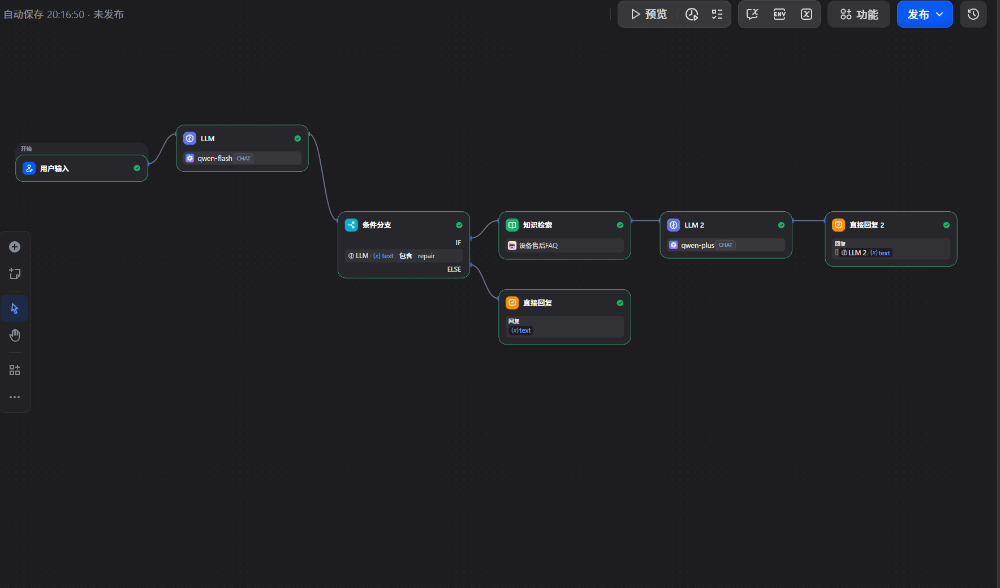
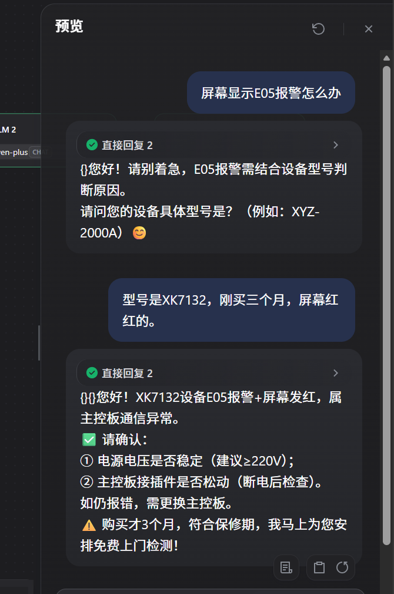
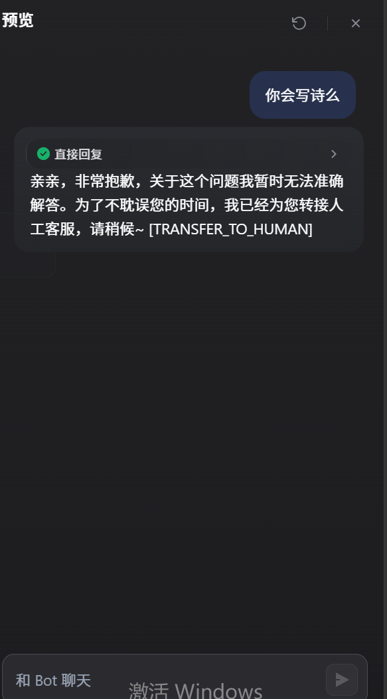

# AI智能客服系统 (B端制造业售后)

## 📝 项目简介
面向制造业售后场景的 AI 客服 MVP。基于大模型意图识别、RAG 知识库检索与多轮对话槽位提取，解决设备故障报修与售后政策咨询问题，并内置置信度阈值不足时的自动转人工兜底策略。

## 📁 产品设计文档
- 📄 [产品需求文档 (PRD)](./AI智能客服系统_PRD_V1.0.md)
- 📊 [竞品分析报告](./AI智能客服-竞品分析报告.md) 
- 🎨 [高保真原型图 (PDF)](./AI智能客服系统-原型图.pdf)
- 📈 [业务流程图 (Mermaid)](./AI智能客服系统_业务流程图.md)

## 📸 运行效果与截图
### 1. Dify 全局工作流画布

### 2. 多轮对话与槽位提取效果

### 3. 异常兜底与转人工

## 💡 核心产品思考
1. **意图路由**：前置意图识别，仅报修场景触发昂贵的RAG检索，降低Token成本。
2. **槽位提取**：通过System Prompt强约束，引导大模型在信息缺失时主动追问（型号/故障/购买时间），实现多轮对话。
3. **异常兜底**：当大模型无法解答或用户为闲聊时，强制输出 `[TRANSFER_TO_HUMAN]` 转人工，规避AI幻觉风险。
