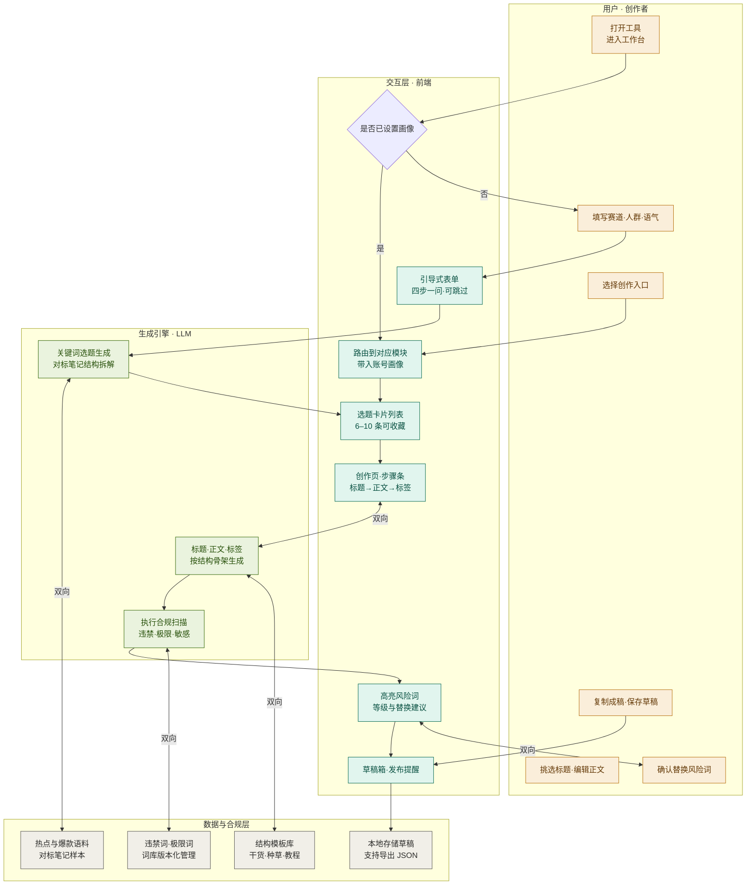
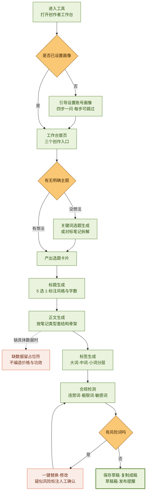
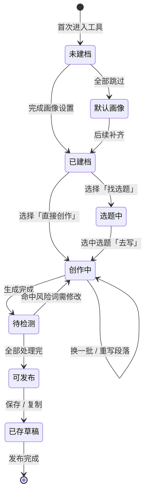
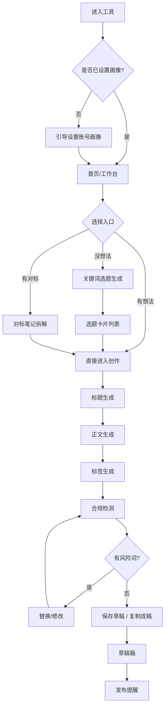

# 小红书生成助手 · 业务流程图

| 项目   | 内容                                        |
| ---- | ----------------------------------------- |
| 文档名称 | 小红书生成助手 · 业务流程图                           |
| 文档版本 | v1.0                                      |
| 作者   | 卢心如                                       |
| 创建日期 | 2026-09-11                                |
| 依据文档 | 《小红书生成助手 PRD v1.0》                        |
| 文档说明 | 以业务视角梳理产品端到端流程，共 4 张图，分别对应分工、步骤、旅程、页面四种视角 |

> **图示说明**：本文档共含 4 张流程图，视角不同、用途不同，请按需取用，不建议全部堆进同一份交付物。
>
> | 图        | 视角  | 回答的问题         | 建议用途        |
> | -------- | --- | ------------- | ----------- |
> | 一、泳道视图   | 分工  | 谁负责什么         | 团队对齐 / 开发排期 |
> | 二、主线视图   | 步骤  | 每一步在干什么、哪里会出错 | 需求评审 / 面试讲解 |
> | 三、用户状态流转 | 旅程  | 用户处在哪个阶段      | 作品集讲完整闭环    |
> | 四、页面流程图  | 页面  | 页面怎么跳转        | 交互稿 / 原型对照  |

---

## 一、业务流程图 · 泳道视图

四个角色自上而下排列，横向箭头表示跨层协作。

**四个角色职责边界：**

| 角色         | 职责                | 关键交付                |
| ---------- | ----------------- | ------------------- |
| 用户 · 创作者   | 提供账号定位与创作意图，做最终决策 | 画像信息、选题采纳、风险词处置     |
| 交互层 · 前端   | 承接输入、呈现结果、管理本地状态  | 表单、卡片列表、创作页、草稿箱     |
| 生成引擎 · LLM | 生成选题与正文，执行评分与合规扫描 | 选题卡片、标题正文标签、风险清单    |
| 数据与合规层     | 提供语料、模板、词库与存储能力   | 热点语料、结构模板、词库版本、草稿存储 |

---

## 二、业务流程图 · 主线视图

端到端主线，含 3 处判断分支与 4 处兜底。

**三处判断分支：** 画像是否已设置 / 有无明确主题 / 合规检测是否有风险词。

**四处兜底速查：**

| 位置   | 兜底策略                           | PRD 依据            |
| ---- | ------------------------------ | ----------------- |
| 画像设置 | 全部跳过 → 用系统默认画像并提示完善            | 4.2.1 异常处理        |
| 选题生成 | 关键词过宽 → 提示补人群与场景；超时 → 自动重试 1 次 | 4.2.2 异常处理        |
| 正文生成 | 缺具体事实 → 留 `【请填入】`，禁止编造         | 4.2.4 事实性兜底原则（红线） |
| 合规检测 | 疑似隐晦导流 → 标注「疑似」提示人工确认          | 4.2.6 异常处理        |

---

## 三、用户状态流转（补充视角）

**状态说明：**

| 状态   | 含义                | 出口           |
| ---- | ----------------- | ------------ |
| 未建档  | 首次使用，尚无账号画像       | 完成设置 / 跳过用默认 |
| 已建档  | 画像就绪，可开始创作        | 找选题 / 直接创作   |
| 选题中  | 浏览选题卡片，未选定        | 选中「去写」进入创作   |
| 创作中  | 标题 / 正文 / 标签生成与编辑 | 生成完成后进入待检测   |
| 待检测  | 内容已完成，等待合规扫描      | 处理完风险词转可发布   |
| 可发布  | 无风险词，可保存或复制       | 保存草稿         |
| 已存草稿 | 内容已沉淀，等待发布        | 发布完成         |

---

## 四、页面流程图（PRD 原版留档）

**与主线视图的差异对照：**

| 差异点  | 页面流程图               | 主线视图                    |
| ---- | ------------------- | ----------------------- |
| 入口分流 | 三路（没想法 / 有想法 / 有对标） | 两路（没想法 / 有想法），拆解并入「没想法」 |
| 兜底分支 | 无                   | 补入 4 处兜底（含事实留空红线）       |
| 视角   | 页面跳转                | 业务步骤                    |
| 节点数  | 12 个                | 13 个 + 异常处理             |

---

## 五、关键设计说明

### 5.1 为什么「事实留空」要单独画成兜底分支

PRD 把它定为红线：种草 / 教程类正文涉及价格、功效、成分、地点时，用户没提供就只能留 `【请填入】`。这不是技术限制，而是**信任设计**——编造内容会让用户发布后翻车，代价远高于「少写一句」。

### 5.2 为什么合规检测独立成环节

合规是发布前的硬门槛，且需要词库版本化、可观测拦截率，必须单独成环节；而关键词选题与对标拆解对用户是同一件事——「我还没想好写什么」，合并后流程更短。

### 5.3 为什么「替换后重新检测」是回路

替换建议本身可能引入新的风险词（比如换了另一个极限词）。设计成回环能让用户停在「可以发布了 ✓」的状态，而不是检测一次就放行。

---

## 六、待补缺口

流程梳理中发现两处逻辑不完整，建议补入 PRD 下一版：

| #   | 缺口        | 现象                                          | 建议                 |
| --- | --------- | ------------------------------------------- | ------------------ |
| 1   | 断点续写缺状态入口 | PRD 4.2.4 写了「生成中断保留已生成部分」，但流程图与原型都没有对应的恢复入口 | 在创作页补「恢复上次生成」的状态位  |
| 2   | 选题库回填断路   | M2 的选题库（收藏 / 打分 / 备注）在选题产出后就断了，未回流到后续创作     | 补一条「选题库 → 直接创作」的通路 |

---

## 附录：Mermaid 渲染环境说明

| 环境               | flowchart | stateDiagram-v2 | 备注                |
| ---------------- | --------- | --------------- | ----------------- |
| 飞书文档             | ✅         | ✅               | 推荐，` ` 换行支持良好 |
| 腾讯文档             | ✅         | ✅               | 推荐，可多端同步编辑        |
| 语雀               | ✅         | ✅               | —                 |
| Notion           | ✅         | ✅               | —                 |
| GitHub / VS Code | ✅         | ✅               | 需安装 Mermaid 插件    |
| 本地 .md 文件        | ❌         | ❌               | 只能看到源码，不会渲染       |

---

*文档作者：卢心如 ｜ 版本 v1.0 ｜ 制图日期：2026-09-11 ｜ 依据《小红书生成助手 PRD v1.0》梳理*
