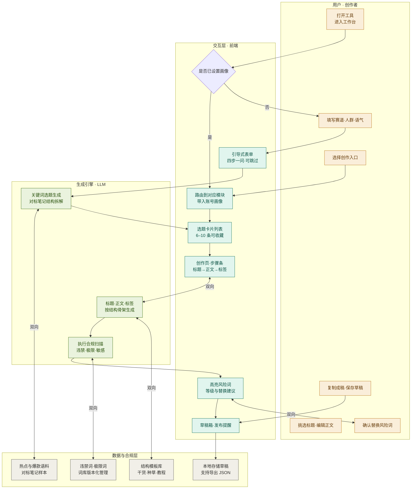
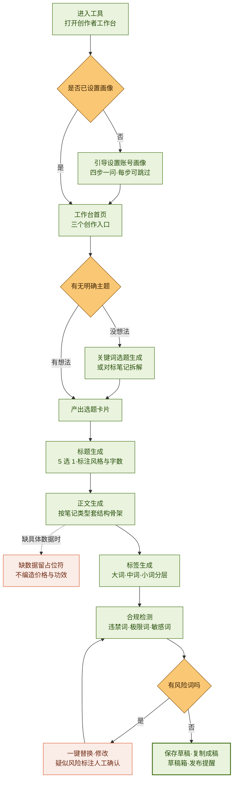
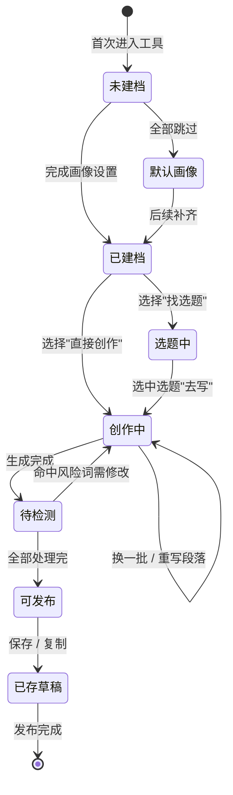
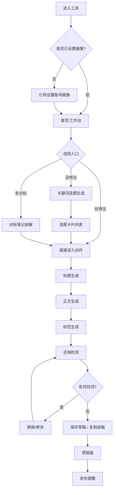

# 小红书生成助手 · 业务流程图（Mermaid 版）

> 依据《小红书生成助手 PRD v1.0》梳理 ｜ 2026-09-11
>
> 共 4 张图，**视角不同、用途不同**，请按需取用，不要全部堆进同一份文档：
>
> | 图 | 视角 | 回答的问题 | 建议用途 |
> |---|---|---|---|
> | 1. 泳道视图 | 分工 | 谁负责什么 | 团队对齐 / 开发排期 |
> | 2. 主线视图 | 步骤 | 每一步在干什么、哪里会出错 | 需求评审 / 面试讲解 |
> | 3. 用户状态流转 | 旅程 | 用户处在哪个阶段 | 作品集讲完整闭环 |
> | 4. PRD 原版页面流 | 页面 | 页面怎么跳转 | 交互稿 / 原型对照 |

---

## 1. 业务流程图 · 泳道视图

四个角色自上而下排列，横向箭头表示跨层协作。

> ⚠️ Mermaid 标准 `flowchart` **没有泳道（swimlane）语法**，此处用 `subgraph` 按角色分组近似实现：视觉上是「分成四块」，不是跨列对齐的真泳道。要严格泳道效果需用 `sequenceDiagram` 或专业绘图工具。

---

## 2. 业务流程图 · 主线视图

端到端主线，含 3 处判断分支与 4 处兜底。**这是信息密度最高、最适合讲解的一张。**

**四处兜底速查：**

| 位置 | 兜底 | PRD 依据 |
|---|---|---|
| 画像设置 | 全部跳过 → 用系统默认画像并提示完善 | 4.2.1 异常处理 |
| 选题生成 | 关键词过宽 → 提示补人群与场景；超时 → 自动重试 1 次 | 4.2.2 异常处理 |
| 正文生成 | 缺具体事实 → 留 `【请填入】`，禁止编造 | 4.2.4 事实性兜底原则（红线） |
| 合规检测 | 疑似隐晦导流 → 标注「疑似」提示人工确认 | 4.2.6 异常处理 |

---

## 3. 用户状态流转（补充视角）

> 这张图 **PRD 里没有**，是把 M1–M6 六个模块串成用户旅程，适合在作品集里讲「完整闭环」。

---

## 4. PRD 原版页面流程图（留档对照）

> 摘自 PRD v1.0 第 6.1 节，**未作改动**。这是**页面视角**，与上面两张业务视角互为补充。

**与主线视图的差异：**

| 差异点 | PRD 原版 | 主线视图 |
|---|---|---|
| 入口分流 | 三路（没想法 / 有想法 / 有对标） | 两路（没想法 / 有想法），拆解并入「没想法」 |
| 兜底分支 | 无 | 补入 4 处兜底（含事实留空红线） |
| 视角 | 页面跳转 | 业务步骤 |
| 深度 | 12 个节点 | 13 个节点 + 异常处理 |

---

## 附：两张补充说明

### Mermaid 渲染环境要求
- 飞书 / 腾讯文档 / Notion 均支持 `flowchart` 与 `stateDiagram-v2`
- GitHub / VS Code 需 Mermaid 插件
- **`classDef` 配色在部分平台会被忽略**（降级为默认灰蓝），属正常现象，不影响结构可读性
- ` ` 换行在飞书与腾讯文档中支持良好；若某平台不换行，去掉 ` ` 即可

### 待补的两个流程缺口（建议补进 PRD）
1. **断点续写缺状态入口** —— PRD 4.2.4 写了「生成中断保留已生成部分」，但流程图与原型都没有对应的恢复入口，建议在创作页补「恢复上次生成」的状态位。
2. **选题库断头** —— M2 的选题库（收藏 / 打分 / 备注）在第 4 步产出后就断了，没有回流到后续创作的闭环，建议补一条「选题库 → 直接创作」的通路。

---

*依据《小红书生成助手 PRD v1.0》梳理 ｜ 制图日期：2026-09-11*
