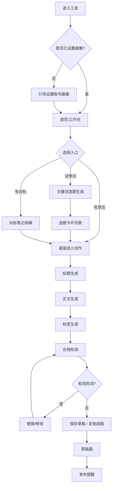

# PRD：小红书生成助手

> 一句话定位：面向个人内容创作者的 AI 创作搭档，从「不知道发什么」到「发布前的最后一道合规检查」，全链路辅助。

---

## 0. 需求摘要（需求分析结论）

| 项目     | 内容                                                                                                                      |
| ------ | ----------------------------------------------------------------------------------------------------------------------- |
| 功能名称   | 小红书生成助手                                                                                                                 |
| 功能背景   | 个人创作者在小红书创作中面临三重卡点：①选题靠灵感、不可持续；②单篇笔记从素材到成稿耗时 1–3 小时；③平台违禁词/广告法规则复杂，容易踩坑限流。现有 AI 写作文具多为「通用大模型套壳」，生成内容同质化、缺少平台语感、不解决合规问题。 |
| 目标用户   | 个人创作者（素人起号 / 垂直领域小博主 / 兼职副业做号者）                                                                                         |
| 核心场景   | 打开工具 → 选一个方向 → 拿到可直接用的选题与成稿 → 优化并检测合规 → 复制发布                                                                            |
| 业务目标   | 把「产出一篇可发布笔记」的时间从 **平均 90 分钟压缩到 15 分钟以内**，并让新手不再因合规问题被限流                                                                 |
| 优先级    | P0（MVP，4 周）                                                                                                             |
| 期望上线时间 | MVP：第 4 周末                                                                                                              |

### 差异化定位

| 维度  | 通用 AI 写作工具  | 本产品                                 |
| --- | ----------- | ----------------------------------- |
| 选题  | 无，或让用户自己填   | 基于热点 + 赛道 + 账号定位主动推荐，可收藏打分          |
| 语感  | 通用书面语，AI 味重 | 内置笔记类型模板（干货/种草/教程/避雷/探店），按平台语感生成    |
| 合规  | 不检测         | 违禁词、极限词、广告法词实时检测，发布前拦截              |
| 可用性 | 生成完还得自己大改   | 直接给可复制成稿（标题 5 选 1 + 正文 + 标签 + 封面文案） |
| 闭环  | 无           | 草稿箱 + 发布提醒，形成「选题—创作—发布」闭环           |

---

## 1. 文档信息

| 项目     | 内容        |
| ------ | --------- |
| 文档版本   | v1.0      |
| 创建日期   | 2026-08-1 |
| 作者     | 卢心如       |
| 评审人    | 卢心如       |
|   |      |

---

## 2. 背景与目标

### 2.1 背景

小红书是当前个人创作者做副业/起号的首选平台之一，但创作门槛并不低：

1. **选题焦虑**：新手不知道「发什么有人看」，靠刷同行「洗选题」，既不持续也不精准。
2. **产能瓶颈**：单篇笔记从想、写、配图到配标签，平均耗时 1–3 小时，日更难以维持。
3. **合规风险**：小红书对违禁词、导流词、极限词、医疗功效等管控严格，一条违规就可能限流，而新手普遍不清楚规则边界。
4. **工具割裂**：现有 AI 写作工具要么是通用大模型（语感不对、AI 味重），要么只解决「写」这一环，选题和合规仍然是空白。

机会点：做一个**专为小红书场景调优，且把「选题—成稿—合规」串成闭环**的轻量工具。

### 2.2 目标

* **用户价值**：让不具备文案能力的普通人，也能稳定产出「平台语感正确 + 基本合规」的笔记草稿。

* **业务价值**：形成高频使用习惯（日更创作者每天至少打开 1 次），沉淀选题库与生成历史，建立数据壁垒。

### 2.3 成功指标（MVP 阶段）

| 指标      | 定义                 | 目标值         |
| ------- | ------------------ | ----------- |
| 单篇成稿耗时  | 从进入生成页到复制成稿的中位时长   | ≤ 15 分钟     |
| 生成采纳率   | 复制/保存的生成结果 ÷ 总生成次数 | ≥ 40%       |
| 7 日留存   | 首次使用后 7 天内再次使用     | ≥ 30%       |
| 合规拦截有效数 | 被检测出风险并修改后发布的笔记数   | 持续记录（无硬性目标） |
| 周活跃产出   | 单个活跃用户周均产出草稿数      | ≥ 5 篇       |

> 说明：MVP 阶段以「是否真的被用起来」为核心，不追求内容分发的站内数据（暂不做发布打通）。

---

## 3. 用户场景

### 3.1 目标用户

**核心画像：垂直领域小博主 / 副业做号者**

* 年龄：20–35 岁

* 特征：有一个明确领域（美食、职场、学习、家居、母婴、穿搭……），想做起来但缺方法论和产能

* 技能：不擅长文案，会用 AI 工具，但嫌通用工具「不好用、改起来更累」

* 目标：稳定日更或周更 3 篇以上，涨粉 / 涨赞 / 接广

**次要画像：素人起号者**

* 完全从 0 开始，连定位都没想清楚，最需要「选题 + 方向」的引导

### 3.2 用户故事

* 作为**新手博主**，我希望**工具主动给我推荐适合我赛道的选题**，以便**我不用每天苦想发什么**。

* 作为**做号者**，我希望**输入一个关键词就能拿到多条可选标题和一篇完整正文**，以便**我 10 分钟内产出一篇可发布笔记**。

* 作为**不熟悉规则的创作者**，我希望**发布前能自动告诉我哪些词不能用**，以便**我避免被限流**。

* 作为**想模仿爆款的创作者**，我希望**能把一篇对标笔记拆解成可复用的结构**，以便**我做出同一结构下属于自己内容的笔记**。

* 作为**日更创作者**，我希望**能管理草稿和发布节奏**，以便**我保持稳定更新不断更**。

### 3.3 使用场景

**场景 1：选题荒，找方向**

* 触发条件：打开工具但不知道该写什么

* 用户行为：选择赛道 → 浏览推荐选题 → 收藏几条

* 预期结果：5 分钟内确定本周 3–5 个选题

**场景 2：从一个想法到一篇成稿**

* 触发条件：已有一个大致主题（如「平价通勤穿搭」）

* 用户行为：输入关键词 → 选笔记类型与语气 → 生成 → 从 5 个标题中选 1 → 调整正文 → 复制

* 预期结果：15 分钟内拿到可直接发布的成稿

**场景 3：发布前合规自查**

* 触发条件：已写好或已生成笔记

* 用户行为：粘贴/生成内容 → 一键检测

* 预期结果：明确标出风险词、风险等级、替换建议

**场景 4：对标爆款仿写**

* 触发条件：看到一篇高赞笔记想借鉴

* 用户行为：粘贴对标笔记 → 拆解出结构（钩子/痛点/论证/CTA）→ 用自己的领域重写

* 预期结果：产出一篇结构相同、内容原创的笔记

---

## 4. 功能需求

### 4.1 功能清单

| 模块       | 功能点               | 优先级 | 备注             |
| -------- | ----------------- | --- | -------------- |
| M1 账号与定位 | 账号画像设置（赛道/人群/语气）  | P0  | 全流程生成的上下文基础    |
| M1 账号与定位 | 人设与内容风格模板         | P1  | 可保存多套风格        |
| M1 账号与定位 | 多账号管理             | P2  | 一人多号场景         |
| M2 选题灵感  | 关键词选题生成           | P0  | 输入关键词 → 输出选题列表 |
| M2 选题灵感  | 热点/趋势选题推荐         | P1  | 依赖热点数据源        |
| M2 选题灵感  | 选题库（收藏 + 打分 + 备注） | P1  |           |
| M2 选题灵感  | 对标笔记拆解            | P1  | 输入笔记 → 结构拆解    |
| M3 内容生成  | 标题生成（5 选 1）       | P0  |           |
| M3 内容生成  | 正文生成（结构化模板）       | P0  |           |
| M3 内容生成  | 话题标签生成            | P0  |           |
| M3 内容生成  | 封面文案生成            | P1  |           |
| M3 内容生成  | 一键成稿（标题+正文+标签+封面） | P1  |           |
| M3 内容生成  | 多风格改写（换语气/换角度）    | P1  |           |
| M3 内容生成  | 配图/素材建议           | P2  |           |
| M4 内容优化  | 违禁词/敏感词检测         | P0  | 发布前必过          |
| M4 内容优化  | 极限词/广告法词检测        | P0  |           |
| M4 内容优化  | 标题吸引力评分 + 优化建议    | P1  |           |
| M4 内容优化  | 原创度/AI 味提示        | P2  |           |
| M5 素材与草稿 | 草稿箱（保存/编辑/复制）     | P0  |           |
| M5 素材与草稿 | 生成历史              | P1  |           |
| M5 素材与草稿 | 素材库/收藏夹           | P1  |           |
| M5 素材与草稿 | 模板市场              | P2  |           |
| M6 发布与复盘 | 内容日历 + 发布提醒       | P1  |           |
| M6 发布与复盘 | 效果数据回填与复盘         | P2  | 依赖手动/半自动回填     |

### 4.2 功能详情

#### 4.2.1 账号画像设置（P0）

**需求描述：** 首次使用时，引导用户建立账号画像，作为后续所有生成内容的上下文约束。画像包含：赛道/领域、目标人群、内容语气（亲切/专业/犀利/温柔…）、笔记类型偏好、常用人设标签。设置后可在生成页随时切换或临时覆盖。

**交互流程：**

1. 用户首次进入 → 弹出引导式表单（分 4 步，每步 1 问，可跳过）
2. 填写赛道（选择器 + 自定义）、目标人群、语气、类型偏好
3. 保存为「默认画像」
4. 后续进入生成页自动带入，页面顶部可一键切换

**页面元素：**

| 元素    | 类型      | 说明                  | 校验规则    |
| ----- | ------- | ------------------- | ------- |
| 赛道选择  | 单选/多选标签 | 预置 30+ 常见赛道         | 至少选 1 个 |
| 自定义赛道 | 输入框     | 补充预置之外              | ≤ 20 字  |
| 目标人群  | 输入/标签   | 如「25–30 岁一线城市女性职场人」 | ≤ 50 字  |
| 语气    | 单选      | 亲切/专业/犀利/温柔/幽默      | 必选 1    |
| 类型偏好  | 多选      | 干货/种草/教程/避雷/探店/Vlog | 至少选 1   |

**异常处理：**

* 用户全部跳过：使用系统默认画像（通用美妆/生活类），并在生成页提示「建议先完善画像以提升生成质量」

* 画像内容含违规词：提示并阻止保存

**埋点需求：**

* `profile_setup_start`：进入画像设置引导

* `profile_setup_finish`：完成画像设置（带是否跳过字段）

---

#### 4.2.2 关键词选题生成（P0）

**需求描述：** 用户输入一个关键词或想法，系统结合账号画像，输出 6–10 条**具体、有角度、可直接写**的选题（而非泛泛的主题）。每条选题需包含：选题标题、切入角度一句话、建议笔记类型、预估受众匹配度。

**交互流程：**

1. 输入关键词（如「平价通勤穿搭」）
2. 可选：指定数量、指定角度（痛点/清单/对比/测评…）
3. 点击生成 → 返回选题卡片列表
4. 每条选题可「收藏」「换一批」「直接去写」

**页面元素：**

| 元素    | 类型   | 说明                 | 校验规则      |
| ----- | ---- | ------------------ | --------- |
| 关键词输入 | 输入框  | 支持一句话描述            | 2–50 字，非空 |
| 角度筛选  | 多选标签 | 痛点/清单/对比/测评/避雷/教程  | 可选        |
| 生成数量  | 下拉   | 6 / 10 条           | 默认 6      |
| 选题卡片  | 卡片列表 | 标题 + 角度 + 类型 + 匹配度 | —         |

**异常处理：**

* 关键词过于宽泛（如「穿搭」）→ 提示「范围较大，建议补充人群或场景」，并给出细化建议

* 关键词涉敏感/违规 → 拦截并提示

* 生成失败/超时 → 保留输入，提供「重试」，最多自动重试 1 次

* 生成内容命中违禁词 → 自动过滤该条并标注

**埋点需求：**

* `topic_generate`：点击生成（带关键词、角度、数量）

* `topic_favorite`：收藏选题

* `topic_to_create`：从选题跳转创作

---

#### 4.2.3 标题生成（P0）

**需求描述：** 基于选题或用户输入的内容，生成 5 个不同风格的标题候选，覆盖：痛点型、数字清单型、悬念型、对比型、身份代入型。每个标题标注风格标签和字符数（小红书标题建议 ≤ 20 字显示完整）。

**交互流程：**

1. 从选题「去写」自动带入主题；或手动输入主题
2. 选择标题风格偏好（可多选，默认全给）
3. 生成 → 展示 5 条标题卡片
4. 支持「单条重写」「全部换一批」「复制」「选为正文标题」

**页面元素：**

| 元素   | 类型  | 说明             | 校验规则          |
| ---- | --- | -------------- | ------------- |
| 主题输入 | 输入框 | 自动带入选题         | 非空，≤ 100 字    |
| 风格多选 | 标签  | 痛点/清单/悬念/对比/代入 | 可多选           |
| 标题卡片 | 列表  | 标题 + 风格标签 + 字数 | 字数 > 20 时高亮提示 |
| 操作按钮 | 按钮  | 复制/重写/采用       | —             |

**异常处理：**

* 生成的标题含违禁词/极限词 → 自动重新生成，二次仍命中则标注风险

* 5 条标题高度雷同 → 触发「多样性重试」，重新生成差异化的 5 条

* 用户主题含违规内容 → 拦截

**埋点需求：**

* `title_generate`：生成标题

* `title_rewrite`：单条重写

* `title_copy`：复制标题（核心采纳指标）

---

#### 4.2.4 正文生成（P0）

**需求描述：** 按所选笔记类型，用固定的**结构骨架**生成正文，避免流水账。内置结构模板：

| 笔记类型 | 结构骨架                                        |
| ---- | ------------------------------------------- |
| 干货   | 痛点钩子 → 核心观点 → 分点论证（3–5 点，每点含小标题+一句解释）→ 总结金句 |
| 种草   | 场景切入 → 踩坑/对比 → 产品亮点（3 点）→ 真实体验 → 购买建议       |
| 教程   | 成果前置 → 所需准备 → 分步骤（带序号）→ 避坑提醒                |
| 避雷   | 结论前置 → 逐条问题 → 个人经历佐证 → 替代方案                 |
| 探店   | 地点/氛围 → 招牌必点 → 真实口感/体验 → 性价比 → 打卡建议         |
| Vlog | 开头抛问题 → 过程叙事 → 情绪高点 → 结尾互动引导                |

生成结果需包含**emoji 使用建议**与**分段换行**，禁止出现「作为 AI 模型」等出戏表述。

**交互流程：**

1. 带入主题/选题 + 类型
2. 可选填写「必须包含的信息」（如价格、地点、个人经历要点）
3. 生成长度选择（短 300 字 / 中 500 字 / 长 800 字）
4. 生成 → 正文进入可编辑区（富文本，支持段落增删）
5. 支持「换语气重写」「扩写某段」「再生成一段」

**页面元素：**

| 元素     | 类型   | 说明      | 校验规则       |
| ------ | ---- | ------- | ---------- |
| 必须包含信息 | 多行输入 | 关键事实/数据 | 可选，≤ 300 字 |
| 长度选择   | 单选   | 短/中/长   | 默认中        |
| 正文编辑器  | 富文本  | 可编辑、分段  | —          |
| 段落操作   | 悬浮按钮 | 重写本段/扩写 | —          |

**异常处理：**

* 生成内容与「必须包含信息」冲突（如编造价格）→ 高亮提示「生成内容包含未经你提供的具体数据，请核实」

* 生成中断 → 保留已生成部分，提供续写

* 内容超长超出平台限制 → 提示并给出精简建议

**埋点需求：**

* `body_generate`：生成正文（带类型、长度）

* `body_paragraph_rewrite`：段落重写

* `body_copy`：复制正文

* `body_edit`：手动编辑（衡量 AI 初稿可用性）

> **事实性兜底原则（重要）**：种草/教程类正文中涉及价格、功效、成分、地点等**具体事实**时，若用户未提供，AI 只能留占位符 `【请填入】`，不得自行编造。理由：编造内容会直接导致用户发布后翻车，是可预见的信任风险。

---

#### 4.2.5 话题标签生成（P0）

**需求描述：** 根据正文内容与选题，生成 6–10 个标签，按「大词（流量）+ 中词（赛道）+ 小词（精准长尾）」三层结构配比，并给出建议顺序（大词在前还是精准词在前按笔记类型给建议）。

**交互流程：**

1. 正文生成后自动触发（或手动点击）
2. 展示标签分组（大/中/小），每个标签标注预估竞争度
3. 支持点击删除、手动添加、一键复制全部

**页面元素：**

| 元素    | 类型       | 说明        | 校验规则      |
| ----- | -------- | --------- | --------- |
| 标签分组  | 三栏/三段    | 大词/中词/小词  | 建议总数 6–10 |
| 标签项   | 可点击 Chip | 标签名 + 竞争度 | 可删除       |
| 自定义标签 | 输入框      | 手动添加      | 不含违规词     |

**异常处理：**

* 生成标签含违规/堆砌嫌疑 → 过滤并提示

* 标签数不足 6 个 → 提示用户手动补充或降低分层要求

**埋点需求：**

* `tag_generate`：生成标签

* `tag_copy`：复制标签

---

#### 4.2.6 违禁词 / 极限词检测（P0，发布前必过）

**需求描述：** 对用户最终内容（标题 + 正文 + 标签 + 封面文案）做合规扫描，输出**问题清单**。词库分三类：

| 类别      | 说明           | 示例               | 风险等级 |
| ------- | ------------ | ---------------- | ---- |
| 平台违禁词   | 导流、联系方式、诱导互动 | 微信号、加V、点我主页      | 高    |
| 广告法极限词  | 绝对化用语        | 最、第一、100%、国家级    | 高    |
| 敏感/医疗功效 | 功效宣称、疗效      | 治疗、根治、美白抗衰（特定语境） | 中    |

**交互流程：**

1. 内容进入检测区（自动带入或粘贴）
2. 点击「一键检测」→ 高亮标出风险词
3. 每个风险词给出：等级 + 原因 + 替换建议
4. 支持「一键替换」「忽略（用户自担）」
5. 全部处理完后显示「可以发布了 ✓」

**页面元素：**

| 元素   | 类型    | 说明               | 校验规则 |
| ---- | ----- | ---------------- | ---- |
| 检测内容 | 只读高亮区 | 风险词标红/黄          | —    |
| 问题列表 | 列表    | 词 + 等级 + 原因 + 建议 | —    |
| 替换按钮 | 按钮    | 应用建议替换           | —    |
| 状态提示 | 状态条   | 风险数 / 通过状态       | —    |

**异常处理：**

* 词库未命中但疑似风险（如隐晦导流「小黄🦆」）→ 标注「疑似」，提示人工确认

* 检测内容为空 → 禁用按钮

* 词库更新 → 版本号展示在检测结果底部，保证可追溯

**埋点需求：**

* `compliance_check`：执行检测（带命中数量、等级分布）

* `compliance_replace`：应用替换

* `compliance_ignore`：忽略风险词

---

#### 4.2.7 草稿箱（P0）

**需求描述：** 用户可将任一生成结果保存为草稿，草稿包含标题、正文、标签、封面文案、来源选题、创建时间、状态（草稿/待发布/已发布）。支持编辑、复制、删除。

**交互流程：**

1. 生成结果页点击「保存草稿」
2. 进入草稿箱查看列表（按时间倒序）
3. 点击进入编辑，或一键复制成稿

**页面元素：**

| 元素   | 类型    | 说明                | 校验规则    |
| ---- | ----- | ----------------- | ------- |
| 草稿列表 | 列表/卡片 | 标题 + 摘要 + 状态 + 时间 | —       |
| 状态筛选 | Tab   | 全部/草稿/待发布/已发布     | —       |
| 操作   | 按钮组   | 编辑/复制/删除          | 删除需二次确认 |

**异常处理：**

* 未登录/本地存储：明确提示「草稿保存在本地浏览器，清缓存会丢失」或提供导出 JSON

* 删除：二次确认，避免误删

**埋点需求：**

* `draft_save`：保存草稿

* `draft_copy`：从草稿复制

* `draft_delete`：删除草稿

---

## 5. 非功能需求

### 5.1 性能需求

* 单次生成（标题/正文）响应 ≤ 8 秒，超时给 loading 与进度提示

* 合规检测响应 ≤ 1 秒（本地词库优先）

* 首屏可交互时间 ≤ 2 秒

### 5.2 安全需求

* 用户内容默认不用于训练；如用于优化需显式授权

* 本地存储敏感信息（草稿、画像）提供导出/清除入口

* 生成内容做基础内容安全过滤（涉政、涉黄、涉暴），命中拦截并提示

### 5.3 兼容性需求

* 浏览器：Chrome / Edge / Safari 最新两个大版本

* 设备：桌面优先（≥1280px），移动端可用（≥375px）为 P1

* 中文为主，标点与 emoji 渲染正常

---

## 6. 界面原型

### 6.1 页面流程图

### 6.2 关键页面

**① 工作台首页**

* 顶部：账号画像卡片（可切换）

* 主体：三大入口卡片（找选题 / 直接创作 / 对标拆解）

* 底部：最近的草稿与收藏选题

**② 创作页（核心页）**

* 左侧：流程步骤条（选题 → 标题 → 正文 → 标签 → 检测）

* 中间：当前步骤的生成/编辑区

* 右侧：合规检测结果常驻（实时更新风险数）

**③ 合规检测页**

* 上方：待检测内容高亮区

* 下方：问题清单（按等级排序），逐条可替换

---

## 7. 数据需求

### 7.1 数据埋点

| 事件                     | 属性             | 说明          |
| ---------------------- | -------------- | ----------- |
| `profile_setup_finish` | 赛道、语气、类型、是否跳过  | 画像完成率       |
| `topic_generate`       | 关键词、角度、数量、返回条数 | 选题生成行为      |
| `topic_to_create`      | 选题 id          | 选题转化率（核心漏斗） |
| `title_generate`       | 主题、风格          | —           |
| `title_copy`           | 标题风格、字数        | 标题采纳率       |
| `body_generate`        | 类型、长度、耗时       | 生成性能        |
| `body_edit`            | 编辑字数差          | AI 初稿可用性    |
| `compliance_check`     | 命中数、等级分布       | 合规价值证明      |
| `compliance_replace`   | 词、等级           | 修改有效性       |
| `draft_save`           | 来源（选题/直接创作）    | —           |

### 7.2 数据报表

* **核心漏斗**：进入 → 设置画像 → 生成选题 → 进入创作 → 生成正文 → 检测 → 保存草稿

* **生成质量看板**：采纳率、编辑率、重写率、合规命中率

* **使用频次看板**：DAU/WAU、人均生成次数、人均草稿数

* **内容分布**：赛道分布、笔记类型分布、高风险词 Top 20

---

## 8. 风险评估

| 风险类型  | 风险描述                            | 影响程度 | 应对措施                              |
| ----- | ------------------------------- | ---- | --------------------------------- |
| 内容风险  | AI 生成内容与真实情况不符（编造价格/功效），用户发布后翻车 | 高    | 强制「事实留空」策略；具体数据必须由用户提供；检测页提示核实    |
| 合规风险  | 词库不全 / 更新滞后，漏检导致用户被限流           | 高    | 词库版本化管理 + 多维词库来源；检测结果标注版本；持续灰度补充  |
| 平台风险  | 小红书官方规则/接口变化（如限制第三方工具）          | 中    | 不做自动发布打通，工具定位为「辅助创作」，规避账号接口依赖     |
| 同质化风险 | 生成内容千篇一律，用户发布后数据差               | 高    | 内置多结构模板 + 画像约束 + 多样性重试；引导用户填入个人经历 |
| 技术风险  | 大模型响应慢/不稳定                      | 中    | 流式输出 + 超时重试 + 生成结果缓存              |
| 隐私风险  | 用户草稿与画像数据                       | 中    | 本地优先存储；明确告知；提供导出与清除               |
| 资源风险  | 单人/小团队开发，周期紧                    | 中    | MVP 严格砍到 P0；P1/P2 迭代              |

---

## 9. 项目计划

### 9.1 里程碑

| 阶段      | 交付物               | 截止日期   | 负责人 |
| ------- | ----------------- | ------ | --- |
| 需求评审    | PRD 定稿            | 第 1 周  | —   |
| 设计阶段    | 关键页设计稿            | 第 2 周  | —   |
| 开发阶段（一） | 画像 + 选题 + 标题/正文生成 | 第 3 周  | —   |
| 开发阶段（二） | 标签 + 合规检测 + 草稿箱   | 第 4 周  | —   |
| 验收阶段    | MVP 验收 + 内测       | 第 4 周末 | —   |
| 迭代一期    | 热点推荐、对标拆解、封面文案    | 第 6 周  | —   |
| 迭代二期    | 发布日历、素材库、效果复盘     | 第 8 周  | —   |

### 9.2 依赖项

* 大模型 API（生成能力）

* 违禁词/极限词词库（需持续维护）

* 热点数据源（P1 阶段）

* 前端本地存储方案（草稿持久化）

---

## 10. 附录

### 10.1 术语表

| 术语       | 解释                           |
| -------- | ---------------------------- |
| 画像       | 账号的赛道、人群、语气等生成约束条件的集合        |
| 笔记类型     | 干货/种草/教程/避雷/探店/Vlog 等结构模板    |
| 大词/中词/小词 | 标签按搜索量分层的三类，大词流量高竞争大，小词精准转化好 |
| 极限词      | 广告法禁止的绝对化用语，如「最」「第一」「国家级」    |
| 采纳率      | 生成结果被复制/保存的比例，衡量生成可用性的核心指标   |
| AI 味     | 生成文本过于书面化、缺少个人语气与口语感的特征      |

### 10.2 参考文档

* 小红书社区规范与创作规则（官方）

* 《广告法》绝对化用语相关规定

* 竞品：通用 AI 写作工具、小红书内容分析工具

### 10.3 变更记录

| 版本   | 日期         | 变更内容 | 作者  |
| ---- | ---------- | ---- | --- |
| v1.0 | 2026-08-19 | 初稿   | 卢心如 |

